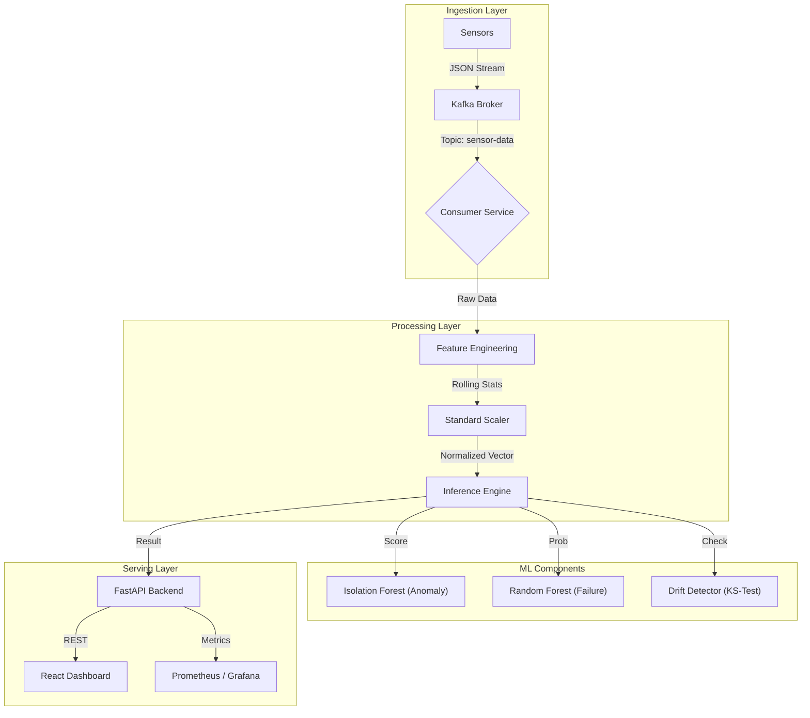

# Predictive Maintenance System


> **Enterprise-grade anomaly detection and failure prediction for industrial IoT.**

---

## 📋 Executive Summary
This system processes high-frequency sensor data (Temperature, RPM, Torque) to detect anomalies and predict equipment failure in real-time. By leveraging **unsupervised learning (Isolation Forest)** for novelty detection and **supervised learning (Random Forest)** for failure classification, it provides actionable insights to reduce unplanned downtime.

---

## 💼 Business Value
Unplanned equipment downtime costs global manufacturers an estimated **$50 billion annually**. This solution addresses this critical inefficiency by:
- **Reducing Unplanned Downtime**: Predicting failures *before* they occur allows for scheduled maintenance windows.
- **Optimizing Asset Life**: Identifying abnormal operating conditions (drift) extends machinery lifespan.
- **Operational Efficiency**: Real-time dashboards provide instant visibility into fleet health, replacing reactive fire-fighting with proactive monitoring.

---

## 🏗 System Architecture

The system follows an **Event-Driven Microservices** architecture to ensure scalability and decoupling.



### Key Components
- **Ingestion**: Apache Kafka handles high-throughput sensor streams.
- **Backend**: FastAPI (Python 3.11) serves predictions and manages background inference tasks.
- **ML Engine**: Scikit-learn models wrapped in a production service with model versioning and drift detection.
- **Frontend**: React + Vite dashboard for real-time visualization of machine health.

---

## 🧠 Machine Learning Approach

### 1. Feature Engineering
Raw sensor streams are enriched to capture temporal dependencies:
- **Rolling Statistics**: 10-minute moving averages and standard deviations to capture volatility.
- **Deltas**: Rate-of-change features to detect rapid temperature spikes or torque fluctuations.

### 2. Dual-Model Strategy
- **Anomaly Detection (`IsolationForest`)**: 
    - *Purpose*: Identify "unknown unknowns"—operating conditions that deviate from the norm but haven't been seen before.
    - *Method*: Unsupervised learning on normal operating data.
- **Failure Prediction (`RandomForestClassifier`)**: 
    - *Purpose*: Predict known failure modes (Tool Wear, Overheating).
    - *Method*: Supervised learning on historical failure logs.

### 3. Operational Monitoring
- **Data Drift**: Continuous Kolmogorov-Smirnov (KS) tests compare live traffic against the training baseline to alert on distribution shifts.
- **Model Versioning**: Artifacts are versioned (`v1`, `v2`) to support A/B testing and atomic rollbacks.

---

## 🚀 Quick Start

### Prerequisites
- Docker Desktop or Podman
- Python 3.11+ (for local dev)

### Run with Docker (Recommended)
The entire stack (Kafka, Backend, Frontend) is containerized.

```bash
# Clone the repository
git clone https://github.com/theNeuralHorizon/predictive-maintenance-system.git
cd predictive-maintenance-system

# Start services
docker compose -f infra/docker-compose.yml up --build
```

Access the dashboard at **[http://localhost:5173](http://localhost:5173)**.

### Operational Metrics
- **Prometheus Metrics**: `GET /metrics`
- **Drift Report**: `GET /api/drift`
- **Health Check**: `GET /`

---

## 🛠 Tech Stack

| Domain | Technologies |
|--------|--------------|
| **Compute** | Python 3.11, FastAPI, Uvicorn |
| **Data & ML** | Scikit-Learn, Pandas, NumPy, SciPy |
| **Streaming** | Apache Kafka, Zookeeper, AIOKafka |
| **Frontend** | React, Vite, TailwindCSS, Recharts |
| **DevOps** | Docker, GitHub Actions (CI), Render (CD) |
| **Monitoring** | Prometheus Format, Structured Logging |

---

## ☁️ Deployment

This project uses **Infrastructure as Code** (`render.yaml`) for deployment on Render.

1.  Push code to GitHub.
2.  Connect repository to Render.
3.  Deploy using the detected Blueprint.

*Note: Streaming features require an external Kafka provider.*
