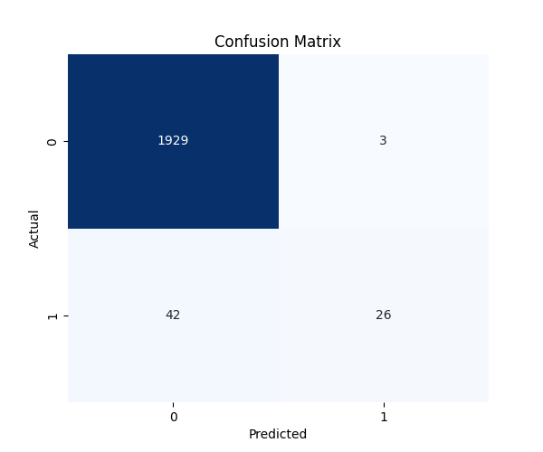
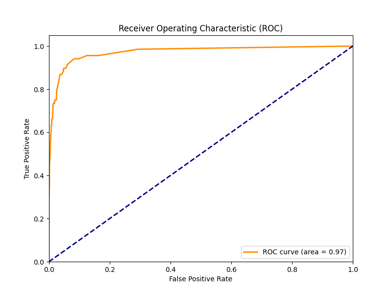

# Model Evaluation Report

## Summary Metrics
| Metric | Value |
| :--- | :--- |
| **Accuracy** | 0.9775 |
| **Precision** | 0.8966 |
| **Recall** | 0.3824 |
| **F1-Score** | 0.5361 |
| **ROC-AUC** | 0.9720 |

## Business Justification: Why Recall Matters?
In predictive maintenance, **Recall** is the most critical metric. 
- **High Recall** means we catch most actual failures (True Positives). 
- A **False Negative** (missing a failure) creates unplanned downtime, costing roughly $260k/hour in automotive manufacturing.
- A **False Positive** (flagging a healthy machine) only costs a scheduled inspection (low cost).
- Therefore, we prioritize a model that minimizes missed failures, even at the expense of slight over-alerting.

## Visualizations

### Confusion Matrix

### ROC Curve

